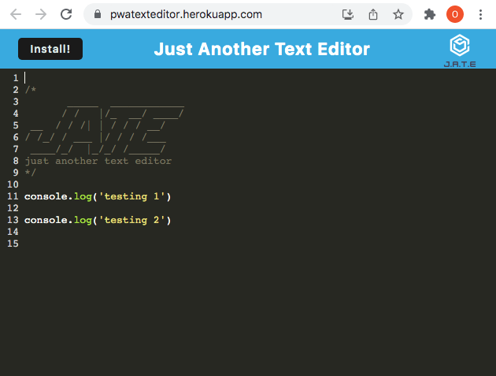

# TEXT EDITOR PWA

# Table of Contents

- [Description](#description)
- [Screenshot](#screenshot)
- [Link](*link)
- [Installation](#installation)
- [Usage](#usage)
- [License](#license)

# Description

This is a Progressive Web Application utilising IndexedDB to store data locally. The PWA will load and function without network connection.

# Screenshot

# Link

<a href="https://pwatexteditor.herokuapp.com">JATE</a>

# Installation

Install the PWA standlone app by clicking the install button on the page.

# License

MIT
